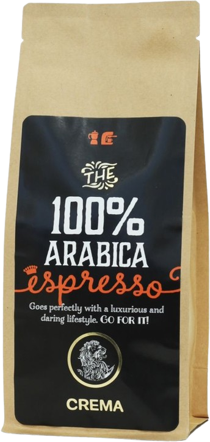
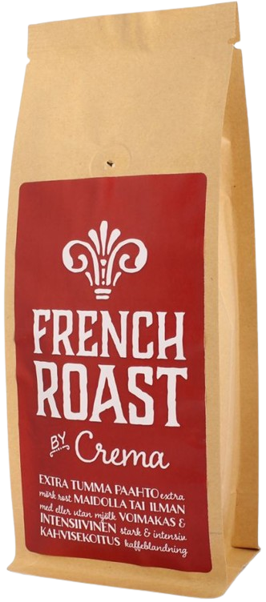
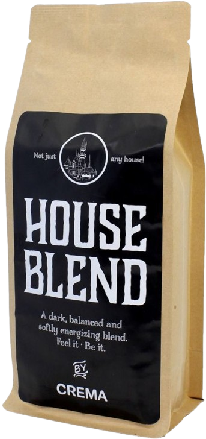

# This is a Step by Step guide on how to create the Responsive Coffee Shop Website

## Step 1: Initial setup

Create the html file, add the links for font awesome, link the css and js file.

<details>
  <summary>Setup for the HTML file</summary>

```html
<!DOCTYPE html>
<html lang="en">
  <head>
    <meta charset="UTF-8" />
    <meta name="viewport" content="width=device-width, initial-scale=1.0" />
    <!-- FONT AWESOME CDN LINK -->
    <link
      rel="stylesheet"
      href="https://cdnjs.cloudflare.com/ajax/libs/font-awesome/6.5.1/css/all.min.css"
    />
    <!-- CSS FILE LINK -->
    <link rel="stylesheet" href="./css/style.css" />
    <title>Responsive coffee shop Website</title>
  </head>

  <body>
    <!-- JS FILE LINK -->
    <script src="./js/app.js"></script>
  </body>
</html>
```

</details>

---

Create the css file `style.css`, start by importing the fonts, then create a few variables for the most used colors, reset the initital styles, style the html and the body/

<details>
  <summary>Setup for the css file</summary>

```css
@import url("https://fonts.googleapis.com/css2?family=Roboto+Mono:ital,wght@0,100..700;1,100..700&display=swap");

:root {
  --main-color: #d3ad7f;
  --black: #13131a;
  --bg: #010103;
  --white: #fff;
  --border: 0.1rem solid rgba(255, 255, 255, 0.3);
}

* {
  font-family: "Roboto Mono", monospace;
  margin: 0;
  padding: 0;
  box-sizing: border-box;
  outline: none;
  border: none;
  text-decoration: none;
  text-transform: capitalize;
  transition: 0.2s linear;
}

html {
  font-size: 62.5%;
  overflow-x: hidden;
  scroll-padding-top: 9rem;
  scroll-behavior: smooth;
}

html::-webkit-scrollbar {
  width: 0.8rem;
}

html::-webkit-scrollbar-track {
  background: transparent;
}

html::-webkit-scrollbar-thumb {
  background: var(--white);
  border-radius: 5rem;
}

body {
  background: var(--bg);
}
```

</details>

---

Create a new file called `app.js`

---

## Step 2: Build, style and add functionality to the Header

Build the header, create the `navbar` `icons`, `search-form`, `cart-items-container`

<details>
  <summary>Start with the header</summary>

```html
<!-- HEADER SECTION STARTS -->
<header class="header">
  <a href="#" class="logo">
    
  </a>

  <nav class="navbar">
    <a href="#home">home</a>
    <a href="#about">about</a>
    <a href="#menu">menu</a>
    <a href="#products">products</a>
    <a href="#review">review</a>
    <a href="#contact">contact</a>
    <a href="#blogs">blogs</a>
  </nav>

  <div class="icons">
    <div class="fas fa-search" id="search-btn"></div>
    <div class="fas fa-shopping-cart" id="cart-btn"></div>
    <div class="fas fa-bars" id="menu-btn"></div>
  </div>

  <div class="search-form">
    <input type="search" id="search-box" placeholder="search here..." />
    <label for="search-box" class="fas fa-search"></label>
  </div>

  <div class="cart-items-container">
    <div class="cart-item">
      <span class="fas fa-times"></span>
      
      <div class="content">
        <h3>cart item 01</h3>
        <div class="price">$15.99/-</div>
      </div>
    </div>
    <div class="cart-item">
      <span class="fas fa-times"></span>
      
      <div class="content">
        <h3>cart item 02</h3>
        <div class="price">$15.99/-</div>
      </div>
    </div>
    <div class="cart-item">
      <span class="fas fa-times"></span>
      
      <div class="content">
        <h3>cart item 03</h3>
        <div class="price">$15.99/-</div>
      </div>
    </div>
    <div class="cart-item">
      <span class="fas fa-times"></span>
      
      <div class="content">
        <h3>cart item 04</h3>
        <div class="price">$15.99/-</div>
      </div>
    </div>
    <a href="#" class="btn">Checkout now</a>
  </div>
</header>
<!-- HEADER SECTION ENDS -->
```

</details>

---

<details>
  <summary>Style the header</summary>

```css
.header {
  background: var(--bg);
  display: flex;
  align-items: center;
  justify-content: space-between;
  padding: 1rem 2%;
  border-bottom: var(--border);
  position: fixed;
  top: 0;
  left: 0;
  right: 0;
  z-index: 1000;
}

.header .logo img {
  height: 18rem;
}

.header .navbar a {
  margin: 0 1rem;
  font-size: 1.6rem;
  color: var(--white);
}

.header .navbar a:hover {
  color: var(--main-color);
  border-bottom: 0.1rem solid var(--main-color);
  padding-bottom: 0.5rem;
}

.header .icons div {
  color: var(--white);
  cursor: pointer;
  font-size: 2.5rem;
  margin-left: 1rem;
}

.header .icons div:hover {
  color: var(--main-color);
}

#menu-btn {
  display: none;
}

.header .search-form {
  position: absolute;
  top: 115%;
  right: 7%;
  background: var(--white);
  width: 50rem;
  height: 5rem;
  display: flex;
  align-items: center;
  transform: scaleY(0);
  transform-origin: top;
}

.header .search-form.active {
  transform: scaleY(1);
}

.header .search-form input {
  height: 100%;
  width: 100%;
  font-size: 1.6rem;
  color: var(--black);
  padding: 1rem;
  text-transform: none;
}

.header .search-form label {
  cursor: pointer;
  font-size: 2.2rem;
  margin-right: 1.5rem;
  color: var(--black);
}

.header .search-form label:hover {
  color: var(--main-color);
}

.header .cart-items-container {
  position: absolute;
  top: 100%;
  right: -100%;
  height: calc(100vh - 9rem);
  width: 35rem;
  background-color: var(--white);
  padding: 0 1.5rem;
}

.header .cart-items-container.active {
  right: 0;
}

.header .cart-items-container .cart-item {
  position: relative;
  margin: 2rem 0;
  display: flex;
  align-items: center;
  gap: 1.5rem;
}

.header .cart-items-container .cart-item .fa-times {
  position: absolute;
  top: 1rem;
  right: 1rem;
  cursor: pointer;
  color: var(--black);
}

.header .cart-items-container .cart-item .fa-times:hover {
  color: var(--main-color);
}

.header .cart-items-container .cart-item img {
  height: 7rem;
}

.header .cart-items-container .cart-item .content h3 {
  font-size: 2rem;
  color: var(--black);
  padding-bottom: 0.5rem;
}

.header .cart-items-container .cart-item .content .price {
  font-size: 1.5rem;
  color: var(--main-color);
}

.btn {
  margin-top: 1rem;
  display: inline-block;
  padding: 0.9rem 3rem;
  font-size: 1.7rem;
  color: var(--white);
  background: var(--main-color);
  border-radius: 0.5rem;
  cursor: pointer;
}

.btn:hover {
  letter-spacing: 0.2rem;
}

.header .cart-items-container .btn {
  width: 100%;
  text-align: center;
}

section {
  padding: 2rem 7%;
}
```

</details>

---

Create variables for the `navbar`, `menuBtn`,`cartItem`,`cartBtn`,`searchForm`,`searchBtn`, add a eventListener for this items.

<details>
  <summary>Set up and build the js </summary>

```js
let navbar = document.querySelector(".navbar");
let menuBtn = document.querySelector("#menu-btn");

let cartItem = document.querySelector(".cart-items-container");
let cartBtn = document.querySelector("#cart-btn");

let searchForm = document.querySelector(".search-form");
let searchBtn = document.querySelector("#search-btn");

menuBtn.addEventListener("click", () => {
  navbar.classList.toggle("active");
  searchForm.classList.remove("active");
  cartItem.classList.remove("active");
});

cartBtn.addEventListener("click", () => {
  cartItem.classList.toggle("active");
  navbar.classList.remove("active");
  searchForm.classList.remove("active");
});

searchBtn.addEventListener("click", () => {
  searchForm.classList.toggle("active");
  navbar.classList.remove("active");
  cartItem.classList.remove("active");
});

window.onscroll = () => {
  navbar.classList.remove("active");
  searchForm.classList.remove("active");
  cartItem.classList.remove("active");
};
```

</details>

---

Add the media queries `990px`,`768px`,`450px` to the css file.

<details>
  <summary>CSS for the media quries</summary>

```css
/* MEDIA QUERIES */
@media (max-width: 990px) {
  html {
    font-size: 55%;
  }

  .header {
    padding: 1.5rem 2rem;
  }

  section {
    padding: 2rem;
  }
}

@media (max-width: 768px) {
  #menu-btn {
    display: inline-block;
  }

  .header .navbar {
    position: absolute;
    top: 100%;
    right: -100%;
    background: var(--white);
    width: 30rem;
    height: calc(100vh - 9.5rem);
  }

  .header .navbar.active {
    right: 0;
  }

  .header .navbar a {
    color: var(--black);
    display: block;
    margin: 1.5rem;
    padding: 0.5rem;
    font-size: 2rem;
  }

  .header .search-form {
    width: 90%;
    right: 2rem;
  }

  .home {
    /* background-position: left; */
    justify-content: center;
    text-align: center;
  }

  .home .content h3 {
    font-size: 4.5rem;
  }

  .home .content p {
    font-size: 1.5rem;
  }
}

@media (max-width: 450px) {
  html {
    font-size: 55%;
  }
}
```

</details>

---

## Step 3: Build ans style the home section

Create the html for the home section

<details>
  <summary>Build the home section</summary>

```html
<!-- HOME SECTION STARTS -->

<section class="home" id="home">
  <div class="content">
    <h3>fresh coffee in the mornings</h3>
    <p>
      Lorem ipsum dolor sit amet consectetur adipisicing elit. Aspernatur
      facilis harum iste libero recusandae quasi dolor saepe magni possimus
      quibusdam.
    </p>
    <a href="#" class="btn">get yours now</a>
  </div>
</section>

<!-- HOME SECTION ENDS -->
```

</details>

---

Styling the home section

<details>
  <summary>Style the home section</summary>

```css
.home {
  min-height: 100vh;
  display: flex;
  align-items: center;
  background: url(../images/hero-img.png) no-repeat;
  background-size: cover;
  background-position: center;
}

.home .content {
  max-width: 60rem;
}

.home .content h3 {
  font-size: 6rem;
  text-transform: uppercase;
  color: var(--white);
}

.home .content p {
  font-size: 1.6rem;
  font-weight: lighter;
  line-height: 1.8;
  padding: 1rem 0;
  color: var(--white);
}
```

</details>

---

## Step 4: Build and style the about section

Build the `about` section of the webpage.

<details>
  <summary>Build the about structure</summary>

```html
<!-- ABOUT SECTION STARTS -->

<section class="about" id="about">
  <h1 class="heading"><span>about</span> us</h1>

  <div class="row">
    <div class="image">
      
    </div>

    <div class="content">
      <h3>what makes our coffee special?</h3>
      <p>
        Lorem ipsum dolor sit amet, consectetur adipisicing elit. Dolor, itaque.
      </p>
      <p>
        Lorem ipsum dolor sit amet consectetur adipisicing elit. Provident ipsa
        molestiae non nesciunt accusantium corrupti!
      </p>
      <a href="#" class="btn">learn more</a>
    </div>
  </div>
</section>

<!-- ABOUT SECTION ENDS -->
```

</details>

---

Style the `about` section.

<details>
  <summary>Style the about section</summary>

```css
.heading {
  text-align: center;
  color: var(--white);
  text-transform: uppercase;
  padding-bottom: 3.5rem;
  font-size: 4rem;
}

.heading span {
  color: var(--main-color);
  text-transform: uppercase;
}

.about .row {
  display: flex;
  align-items: center;
  background: var(--black);
  flex-wrap: wrap;
}

.about .row .image {
  flex: 1 1 45rem;
}

.about .row .image img {
  width: 100%;
}

.about .row .content {
  flex: 1 1 45rem;
  padding: 2rem;
}

.about .row .content h3 {
  font-size: 3rem;
  color: var(--white);
}

.about .row .content p {
  font-size: 1.6rem;
  color: var(--white);
  padding: 1rem 0;
  line-height: 1.8;
}
```

</details>

---

## Step 5: Build and style the menu section

Build the `menu` section

<details>
  <summary>Build the menu section</summary>

```html
<!-- MENU SECTION STARTS -->
<section class="menu" id="menu">
  <h1 class="heading">our <span>menu</span></h1>

  <div class="box-container">
    <div class="box">
      
      <h3>tasty and healty</h3>
      <div class="price">$15.99 <span>20.99</span></div>
      <a href="#" class="btn">add to cart</a>
    </div>

    <div class="box">
      
      <h3>tasty and healty</h3>
      <div class="price">$15.99 <span>20.99</span></div>
      <a href="#" class="btn">add to cart</a>
    </div>

    <div class="box">
      
      <h3>tasty and healty</h3>
      <div class="price">$15.99 <span>20.99</span></div>
      <a href="#" class="btn">add to cart</a>
    </div>

    <div class="box">
      
      <h3>tasty and healty</h3>
      <div class="price">$15.99 <span>20.99</span></div>
      <a href="#" class="btn">add to cart</a>
    </div>

    <div class="box">
      
      <h3>tasty and healty</h3>
      <div class="price">$15.99 <span>20.99</span></div>
      <a href="#" class="btn">add to cart</a>
    </div>

    <div class="box">
      
      <h3>tasty and healty</h3>
      <div class="price">$15.99 <span>20.99</span></div>
      <a href="#" class="btn">add to cart</a>
    </div>
  </div>
</section>
<!-- MENU SECTION ENDS -->
```

</details>

---

Style the `menu` section

<details>
  <summary>Style the menu section</summary>

```css
.menu .box-container {
  display: grid;
  grid-template-columns: repeat(auto-fit, minmax(30rem, 1fr));
  gap: 1.5rem;
}

.menu .box-container .box {
  padding: 5rem;
  text-align: center;
  border: var(--border);
}

.menu .box-container .box img {
  height: 10rem;
}

.menu .box-container .box h3 {
  color: var(--white);
  font-size: 2rem;
  padding: 1rem 0;
}

.menu .box-container .box .price {
  color: var(--white);
  font-size: 2.5rem;
  padding: 5rem 0;
}

.menu .box-container .box .price span {
  font-size: 1.5rem;
  text-decoration: line-through;
}

.menu .box-container .box:hover {
  background: var(--white);
}

.menu .box-container .box:hover > * {
  color: var(--bg);
}
```

</details>

## Step 6: Build and style the product section

Build the `product` section of the webpage

<details>
  <summary>Product section HTML</summary>

```html
<!-- PRODUCTS SECTION STARTS -->
<section class="products" id="products">
  <h1 class="heading">our <span>products</span></h1>

  <div class="box-container">
    <div class="box">
      <div class="icons">
        <a href="#" class="fas fa-shopping-cart"></a>
        <a href="#" class="fas fa-heart"></a>
        <a href="#" class="fas fa-eye"></a>
      </div>
      <div class="image">
        
      </div>
      <div class="content">
        <h3>fresh content</h3>
        <div class="stars">
          <i class="fas fa-star"></i>
          <i class="fas fa-star"></i>
          <i class="fas fa-star"></i>
          <i class="fas fa-star"></i>
          <i class="fas fa-star-half-alt"></i>
        </div>
        <div class="price">$15.99 <span>$20.99</span></div>
      </div>
    </div>

    <div class="box">
      <div class="icons">
        <a href="#" class="fas fa-shopping-cart"></a>
        <a href="#" class="fas fa-heart"></a>
        <a href="#" class="fas fa-eye"></a>
      </div>
      <div class="image">
        
      </div>
      <div class="content">
        <h3>fresh content</h3>
        <div class="stars">
          <i class="fas fa-star"></i>
          <i class="fas fa-star"></i>
          <i class="fas fa-star"></i>
          <i class="fas fa-star"></i>
          <i class="fas fa-star-half-alt"></i>
        </div>
        <div class="price">$15.99 <span>$20.99</span></div>
      </div>
    </div>

    <div class="box">
      <div class="icons">
        <a href="#" class="fas fa-shopping-cart"></a>
        <a href="#" class="fas fa-heart"></a>
        <a href="#" class="fas fa-eye"></a>
      </div>
      <div class="image">
        
      </div>
      <div class="content">
        <h3>fresh content</h3>
        <div class="stars">
          <i class="fas fa-star"></i>
          <i class="fas fa-star"></i>
          <i class="fas fa-star"></i>
          <i class="fas fa-star"></i>
          <i class="fas fa-star-half-alt"></i>
        </div>
        <div class="price">$15.99 <span>$20.99</span></div>
      </div>
    </div>
  </div>
</section>
<!-- PRODUCTS SECTION ENDS -->
```

</details>

---

Style the `product` section

<details>
  <summary>Style the product section</summary>

```css
.products .box-container {
  display: grid;
  grid-template-columns: repeat(auto-fit, minmax(30rem, 1fr));
  gap: 1.5rem;
}

.products .box-container .box {
  text-align: center;
  border: var(--border);
  padding: 2rem;
}

.products .box-container .box .icons {
  display: flex;
  justify-content: center;
}

.products .box-container .box .icons a {
  height: 5rem;
  width: 5rem;
  line-height: 5rem;
  font-size: 2rem;
  border: var(--border);
  color: var(--white);
  margin: 3rem 0.3rem;
}

.products .box-container .box .icons a:hover {
  background: var(--main-color);
}

.products .box-container .box .image {
  padding: 2.5rem 0;
}

.products .box-container .box .image img {
  height: 25rem;
}

.products .box-container .box .content h3 {
  color: var(--white);
  font-size: 2.5rem;
}

.products .box-container .box .content .stars {
  padding: 1.5rem;
}

.products .box-container .box .content .stars i {
  font-size: 1.7rem;
  color: var(--main-color);
}

.products .box-container .box .content .price {
  color: var(--white);
  font-size: 2.5rem;
}

.products .box-container .box .content .price span {
  text-decoration: line-through;
  font-weight: lighter;
  font-size: 1.5rem;
}
```

</details>

## Step 7: Build and style the review section

Build the `review section`

<details>
  <summary>Build the Review section</summary>

```html
<!-- REVIEW SECTION STARTS -->

<section class="review" id="review">
  <h1 class="heading">customer's <span>review</span></h1>

  <div class="box-container">
    <div class="box">
      
      <p>
        Lorem ipsum dolor sit amet, consectetur adipisicing elit. Corrupti sit
        temporibus laudantium atque maxime repudiandae beatae porro doloremque
        quas nemo.
      </p>
      
      <h3>John Doe</h3>
      <div class="stars">
        <i class="fas fa-star"></i>
        <i class="fas fa-star"></i>
        <i class="fas fa-star"></i>
        <i class="fas fa-star"></i>
        <i class="fas fa-star-half-alt"></i>
      </div>
    </div>

    <div class="box">
      
      <p>
        Lorem ipsum dolor sit amet, consectetur adipisicing elit. Corrupti sit
        temporibus laudantium atque maxime repudiandae beatae porro doloremque
        quas nemo.
      </p>
      
      <h3>John Doe</h3>
      <div class="stars">
        <i class="fas fa-star"></i>
        <i class="fas fa-star"></i>
        <i class="fas fa-star"></i>
        <i class="fas fa-star"></i>
        <i class="fas fa-star-half-alt"></i>
      </div>
    </div>

    <div class="box">
      
      <p>
        Lorem ipsum dolor sit amet, consectetur adipisicing elit. Corrupti sit
        temporibus laudantium atque maxime repudiandae beatae porro doloremque
        quas nemo.
      </p>
      
      <h3>John Doe</h3>
      <div class="stars">
        <i class="fas fa-star"></i>
        <i class="fas fa-star"></i>
        <i class="fas fa-star"></i>
        <i class="fas fa-star"></i>
        <i class="fas fa-star-half-alt"></i>
      </div>
    </div>
  </div>
</section>

<!-- REVIEW SECTION ENDS -->
```

</details>

---

Style the `review` section

<details>
  <summary>Style the review section</summary>

```css
.review .box-container {
  display: grid;
  grid-template-columns: repeat(auto-fit, minmax(30rem, 1fr));
  gap: 1.5rem;
}

.review .box-container .box {
  border: var(--border);
  text-align: center;
  padding: 3rem 2rem;
}

.review .box-container .box p {
  font-size: 1.6rem;
  line-height: 1.8;
  color: var(--white);
  padding: 2rem 0;
}

.review .box-container .box .user {
  height: 7rem;
  width: 7rem;
  border-radius: 50%;
  object-fit: cover;
}

.review .box-container .box h3 {
  padding: 1rem 0;
  font-size: 2rem;
  color: var(--white);
}

.review .box-container .box .stars i {
  font-size: 1.5rem;
  color: var(--main-color);
}
```

</details>

## Step 8: Build ans style the contact section

Build the `contact` section

<details>
  <summary>Build the contact section</summary>

```html
<!-- CONTACT SECTION START -->

<section class="contact" id="contact">
  <h1 class="heading"><span>contact us</span></h1>

  <div class="row">
    <iframe
      class="map"
      src="https://www.google.com/maps/embed?pb=!1m18!1m12!1m3!1d1458817.766724174!2d-110.58845503093976!3d44.4279630098569!2m3!1f0!2f0!3f0!3m2!1i1024!2i768!4f13.1!3m3!1m2!1s0x5351e55555555555%3A0xaca8f930348fe1bb!2sYellowstone%20National%20Park!5e0!3m2!1sen!2sbe!4v1711885021387!5m2!1sen!2sbe"
      width="600"
      height="450"
      style="border:0;"
      allowfullscreen=""
      loading="lazy"
      referrerpolicy="no-referrer-when-downgrade"
    ></iframe>

    <form action="">
      <h3>get in touch</h3>
      <div class="inputBox">
        <span class="fas fa-user"></span>
        <input type="text" placeholder="name" />
      </div>
      <div class="inputBox">
        <span class="fas fa-envelope"></span>
        <input type="email" placeholder="email" />
      </div>
      <div class="inputBox">
        <span class="fas fa-phone"></span>
        <input type="number" placeholder="number" />
      </div>
      <input type="submit" class="btn" value="contact now" />
    </form>
  </div>
</section>

<!-- CONTACT SECTION END -->
```

</details>

---

Style the `contact` section

<details>
  <summary>Style the contact section</summary>

```css
.contact .row {
  display: flex;
  background: var(--black);
  flex-wrap: wrap;
  gap: 1rem;
}

.contact .row .map {
  flex: 1 1 45rem;
  width: 100%;
  object-fit: cover;
}

.contact .row form {
  flex: 1 1 45rem;
  padding: 5rem 2rem;
  text-align: center;
}

.contact .row form h3 {
  text-transform: uppercase;
  font-size: 3.5rem;
  color: var(--white);
}

.contact .row form .inputBox {
  display: flex;
  align-items: center;
  margin-top: 2rem;
  margin-bottom: 2rem;
  background: var(--bg);
  border: var(--border);
}

.contact .row form .inputBox span {
  color: var(--white);
  font-size: 2rem;
  padding-left: 2rem;
}

.contact .row form .inputBox input {
  width: 100%;
  padding: 2rem;
  font-size: 1.7rem;
  color: var(--white);
  text-decoration: none;
  background: none;
}
```

</details>

## Step 9: Build and style the blogs section

Buid the `blogs` section.

<details>
  <summary>Build the blogs section</summary>

```html
<!-- BLOGS SECTION START -->

<section class="blogs" id="blogs">
  <h1 class="heading">our <span>blogs</span></h1>

  <div class="box-container">
    <div class="box">
      <div class="image">
        
      </div>
      <div class="content">
        <a href="#" class="title">tasty and refreshing coffee</a>
        <span>by admin / 21st may, 2021</span>
        <p>
          Lorem ipsum dolor sit amet consectetur adipisicing elit. Porro,
          distinctio.
        </p>
        <a href="#" class="btn">read more</a>
      </div>
    </div>

    <div class="box">
      <div class="image">
        
      </div>
      <div class="content">
        <a href="#" class="title">tasty and refreshing coffee</a>
        <span>by admin / 21st may, 2021</span>
        <p>
          Lorem ipsum dolor sit amet consectetur adipisicing elit. Porro,
          distinctio.
        </p>
        <a href="#" class="btn">read more</a>
      </div>
    </div>

    <div class="box">
      <div class="image">
        
      </div>
      <div class="content">
        <a href="#" class="title">tasty and refreshing coffee</a>
        <span>by admin / 21st may, 2021</span>
        <p>
          Lorem ipsum dolor sit amet consectetur adipisicing elit. Porro,
          distinctio.
        </p>
        <a href="#" class="btn">read more</a>
      </div>
    </div>
  </div>
</section>

<!-- BLOGS SECTION END -->
```

</details>

---

Style the `blogs` section

<details>
  <summary>Style the blogs section</summary>

```css
.blogs .box-container {
  display: grid;
  grid-template-columns: repeat(auto-fit, minmax(30rem, 1fr));
  gap: 1.5rem;
}

.blogs .box-container .box {
  border: var(--border);
}

.blogs .box-container .box .image {
  height: 25rem;
  overflow: hidden;
  width: 100%;
}

.blogs .box-container .box .image img {
  height: 100%;
  object-fit: cover;
  width: 100%;
}

.blogs .box-container .box:hover .image img {
  transform: scale(1.2);
}

.blogs .box-container .box .content {
  padding: 2rem;
}

.blogs .box-container .box .content .title {
  font-size: 2.5rem;
  line-height: 1.5;
  color: var(--white);
}

.blogs .box-container .box .content .title:hover {
  color: var(--main-color);
}

.blogs .box-container .box .content span {
  color: var(--main-color);
  display: block;
  padding-top: 1rem;
  font-size: 2rem;
}

.blogs .box-container .box .content p {
  font-size: 1.6rem;
  line-height: 1.8;
  color: var(--white);
  padding: 1rem 0;
}
```

</details>

## Step 10: Build and style the footer section

Build the `footer` section

<details>
  <summary>Build the footer section</summary>

```html
<!-- FOOTER SECTION STARTS  -->

<section class="footer">
  <div class="share">
    <a href="" class="fab fa-facebook-f"></a>
    <a href="" class="fab fa-twitter"></a>
    <a href="" class="fab fa-instagram"></a>
    <a href="" class="fab fa-linkedin"></a>
    <a href="" class="fab fa-pinterest"></a>
  </div>

  <div class="links">
    <a href="#">home</a>
    <a href="#">about</a>
    <a href="#">menu</a>
    <a href="#">products</a>
    <a href="#">review</a>
    <a href="#">contact</a>
    <a href="#">blogs</a>
  </div>

  <div class="credit">created by <span>Todor Simeonov</span></div>
</section>

<!-- FOOTER SECTION ENDS -->
```

</details>

---

Style the `footer`

<details>
  <summary>Style the footer</summary>

```css
.footer {
  background: var(--black);
  text-align: center;
}

.footer .share {
  padding: 1rem 0;
}

.footer .share a {
  height: 5rem;
  width: 5rem;
  line-height: 5rem;
  font-size: 2rem;
  color: var(--white);
  border: var(--border);
  margin: 0.3rem;
  border-radius: 50%;
}

.footer .share a:hover {
  background-color: var(--main-color);
}

.footer .links {
  display: flex;
  justify-content: center;
  flex-wrap: wrap;
  padding: 2rem 0;
  gap: 1rem;
}

.footer .links a {
  padding: 0.7rem 2rem;
  color: var(--white);
  border: var(--border);
  font-size: 2rem;
}

.footer .links a:hover {
  background: var(--main-color);
}

.footer .credit {
  font-size: 2rem;
  color: var(--white);
  font-weight: lighter;
  padding: 1.5rem;
}

.footer .credit span {
  color: var(--main-color);
}
```

</details>
